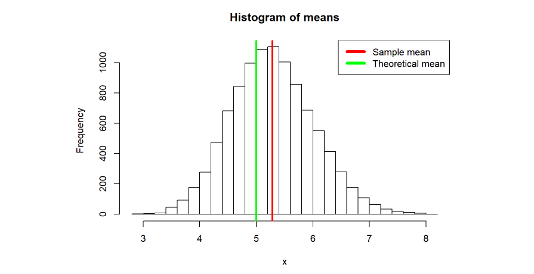
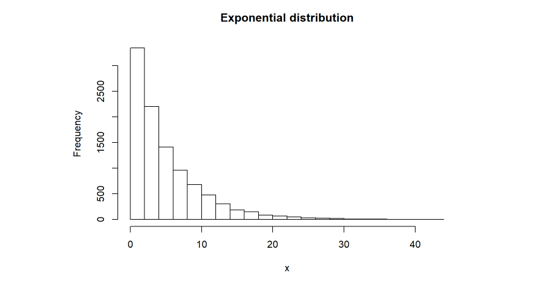
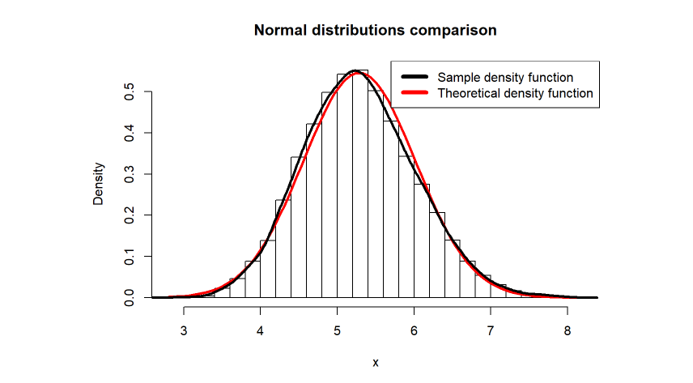
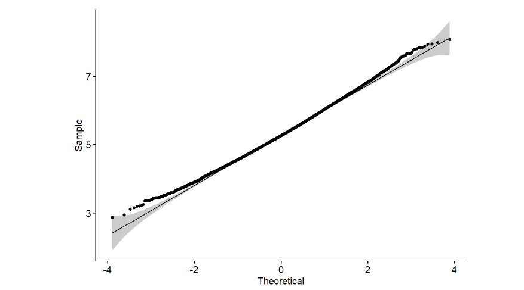

# Part 1: Simulation 

In this project we'll investigate the exponential distribution in R and compare it with the  Central Limit Theorem. We will investigate the distribution of averages of 40 exponentials. I set lambda=0.2 for all of the simulations.

```{r}
n<-40
lambda<-0.2
```

The theoretical mean of an exponential distribution is 1/lambda and the standard deviation is also 1/lambda.

```{r}
mu<-1/lambda
mu
sd<-1/lambda
sd
```

## Theoretical and Sample Distributions

I simulate the exponential distribution 10000 times, taking 10000 random samples with replacement with 40 observations each.

```{r}
B<-10000
x<-rexp(n,lambda)
resamples<-matrix(sample(x,n*B,replace=TRUE),B,n)
means<-apply(resamples,1,mean)
mean(means)
sd(means)
```

The *central limit theorem* states that if you have a population mean mu and standard deviation sd and take sufficiently large random samples from the population with replacement, then the distribution of the sample means will be approximately normally distributed. This will hold true regardless of whether the source population is normal. For the random samples we take from the population, we can compute the mean of the sample means: 

<div align="center">`mean(means)=mu`</div>

and the standard deviation of the sample means:

<div align="center">`sd(means)=sd/sqrt(n)`</div>

So, in this case, the theoretical mean is:

```{r echo=FALSE}
mu
```

and the theoretical standard deviation is:

```{r echo=FALSE}
sd/sqrt(n)
```



If we compare the distribution of 1000 random exponential and the histogram above, we can see that the histogram above is far more Gaussian than the original distribution!



## Normality test

To show if the distribution of means is approximately normal we can use qualitative and visual methods. First, we plot a normal density function with mean `mean(means)` and standard deviation `sd(means)` over the previous histogram.



We can see that the distribution is approximately normal. 

Second, we use a Q-Q plot (or quantile-quantile plot) that draws the correlation between the given sample and the normal distribution.



Moreover, we can perform an Anderson-Darling test, for an accurate result.

```{r}
ad.test(means,mean=mean(means), sd=sd(means), null="pnorm",estimated=TRUE)$p.value
```

The p-value is greater than 0.05, so we can't reject the null hypothesis of normality.
