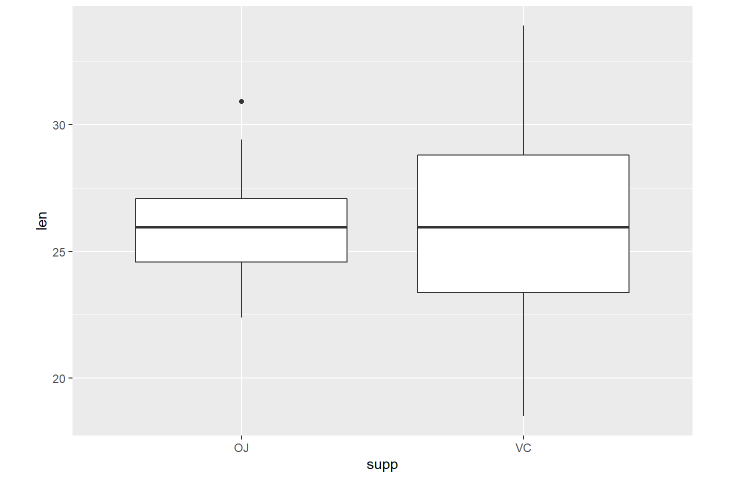

# Part 2: Basic Inferential Data Analysis 

In the second portion of the project, we're going to analyze the ToothGrowth data in the R datasets package.

First, we load the ToothGrowth data and we perform some basic exploratory data analyses. The response is the length of odontoblasts (cells responsible for tooth growth) in 60 guinea pigs. Each animal received one of three dose levels of vitamin C (0.5, 1, and 2 mg/day) by one of two delivery methods, orange juice or ascorbic acid (a form of vitamin C and coded as VC).

```{r}
data(ToothGrowth)
```

```{r echo=FALSE}
ToothGrowth$dose<-factor(ToothGrowth$dose)
```
```{r}
summary(ToothGrowth)
```


Secondly, we use hypothesis tests to compare growth by supp.


We perform a t-test for the two independent group of observations.
```{r}
t.test(ToothGrowth[ToothGrowth$supp=="VC",]$len,ToothGrowth[ToothGrowth$supp=="OJ",]$len,paired=FALSE,var.equal=FALSE)
```

We can see that the p-value is slightly above 0.05, so we are in the acceptance region and we can't reject the null hypothesis. So we accept that the difference in means due to two delivery methods is equal to zero.

Next, we analyze the difference due to the three dose levels of vitamin C (0.5, 1, and 2 mg/day).


We can see that there is a significant difference between the three dose levels.

So, we try to see if there is a significant difference in means due to the delivery method within each dose level.


We perform a t-test for the two independent group of observations.
```{r}
t.test(dose05[dose05$supp=="OJ",]$len,dose05[dose05$supp=="VC",]$len,paired=FALSE,var.equal=FALSE)
```

We fail to reject the null hypotesis, so the difference in mean is equal to 0.

### Dose Level = 1.0


We perform a t-test for the two independent group of observations.
```{r}
t.test(dose1[dose1$supp=="OJ",]$len,dose1[dose1$supp=="VC",]$len,paired=FALSE,var.equal=FALSE)
```

We reject the null hypotesis, so the difference in mean is different from 0.

### Dose Level = 2



We perform a t-test for the two independent group of observations.
```{r}
t.test(dose2[dose2$supp=="OJ",]$len,dose2[dose2$supp=="VC",]$len,paired=FALSE,var.equal=FALSE)
```

We fail to reject the null hypotesis, so the difference in mean is equal to 0.

## Conclusions

Overall, we can conclude that the methods used to deliver the vitamin C don't affect the growth of odotoblasts. There's only one case where we can see a significant difference in means between the two methods, and it's when the dose level of vitamin C is 1 mg/day.
